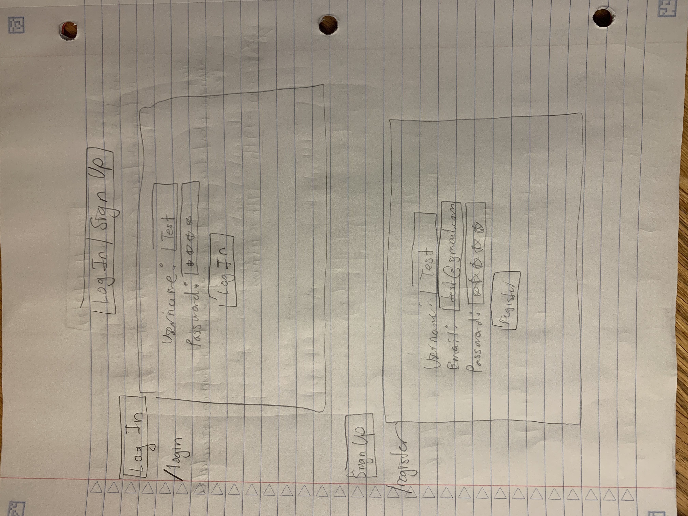
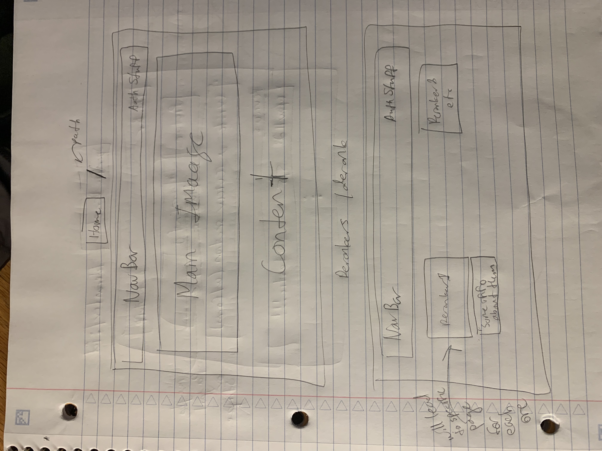
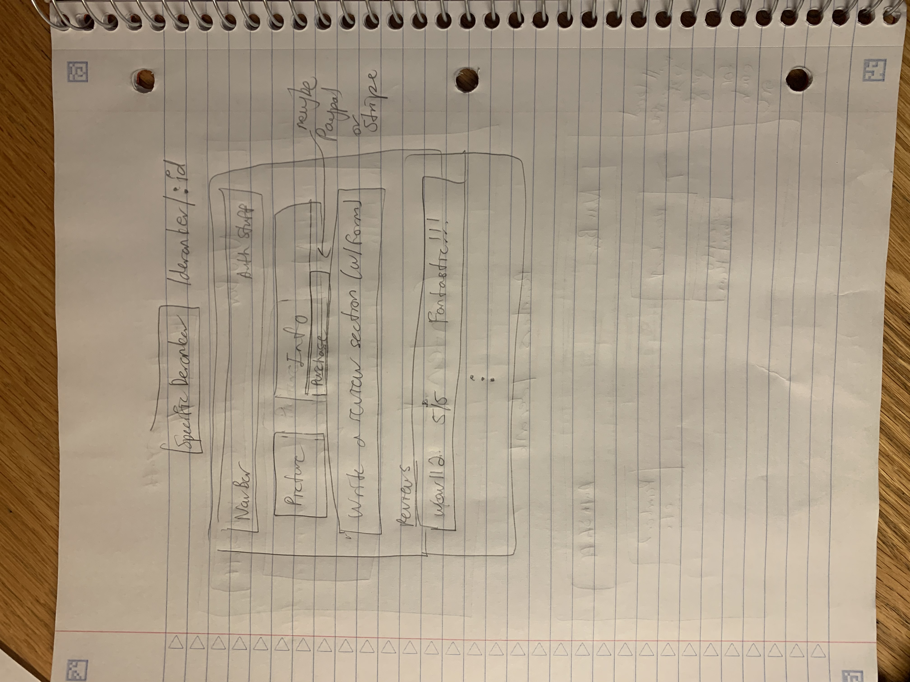

# Rocket League Decelerator

## Overview


Ever wanted to derank your Rocket League account? Either to smurf, play with friends, or just to lose? Rocket League Decelerator can handle that for you!

Rocket League Decelerator is a web app that will allow users to "hire" our certified (de)boosters to derank your account. Users can register and login. Once they're logged in, they can hire a deranker and/or write reviews for a specific deranker. 

## Data Model

The application will store User, Reviews, and Derankers (the rest TBD)

* users can write as many reviews as they want
* each review consists of a rating, a description, and a deranker
* derankers will store their basic information and reviews as subdocs 

An Example User:

```javascript
{
  username: "hehe xd",
  password: // some sort of password encryption,
  email: "hehexd123@realemail.com"
}
```

An Example Deranker with Review Subdoc (exact structure TBD):

```javascript
{
  name: "John Doe",
  reviews: [
    { rating: 5, userId: "_212417", content: "Did a phenomenal job!"}, // userId refers to whow rote review
    { rating: 3, userId: "_214142", content: "Was a few days late in fulfilling the order"},
  ],
  createdAt: // timestamp
}
```


## [Link to Commented First Draft Schema](./backend/models/User.model.mjs) 


## Wireframes

(__TODO__: wireframes for all of the pages on your site; they can be as simple as photos of drawings or you can use a tool like Balsamiq, Omnigraffle, etc.)

/login & /register - page for authentication stuff



/derank - page for showing all derankers



/derank/:id - page for specific deranker



## [Site map](documentation/site_map.jpg)

## User Stories or Use Cases

1. as non-registered user, I can register a new account with the site
2. as a user, I can view all of the available derankers 
3. as a user, I can log in to the site 
4. as a user, I can write a review 
5. as a user, I can purchase a session (Don't know if I can get that far)
6. as a user, I can view past sessions (time permitted)

## Research Topics

* (3 points) Configuration Management
    * I'm doing to store the port and my MongoDB URI (Atlas) in my dotenv file
    for my database
* (1 point) External API Use/Client Side Library (Time permitted)
    * I will be using Stripe or Paypal JS libraries or REST APIs to make payment orders
* (6 points) Front-end framework
    * Will use Vue.js as a front-end framework; I only have React experience, so this will be something new

10 points total out of 8 required points (___TODO__: addtional points will __not__ count for extra credit)


## [Link to Initial Main Project File](app.mjs) 


## Annotations / References Used


